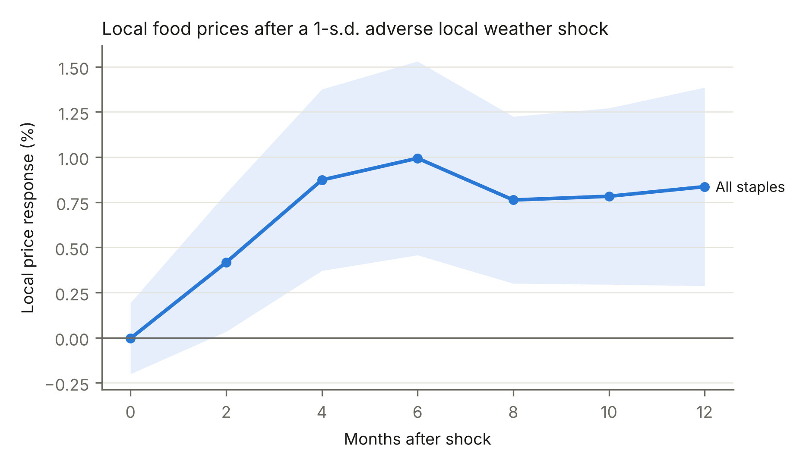
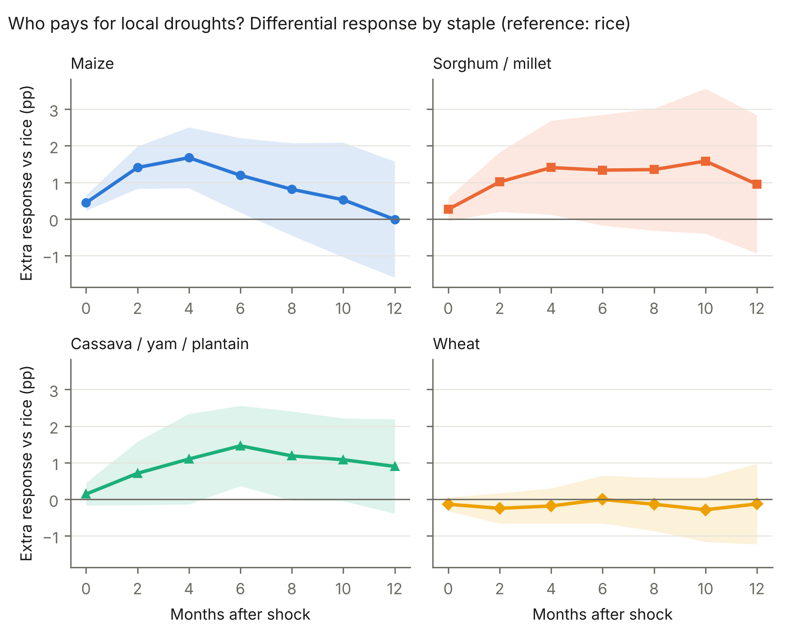
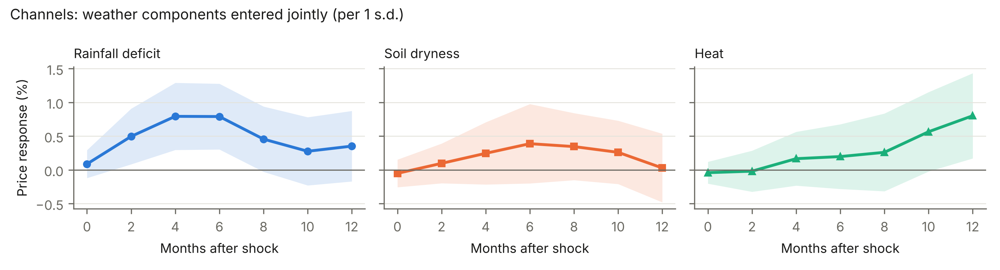

# Abstract {.unnumbered}

Climate shocks are expected to raise food prices, but the evidence comes mostly from national price indices or single countries, and it says little about which foods and which markets absorb the shock. We combine 26 years of monthly retail prices from 3,221 markets in 85 low- and middle-income countries with reanalysis weather measured at each market. Panel local projections with series × calendar-month and country × year fixed effects show that a one-standard-deviation adverse weather anomaly (hotter and drier than normal) raises local staple prices by 0.99 percent after six months (95% CI 0.46 to 1.53). The effect persists for at least a year and survives correction for testing at seven horizons. The burden falls on staples that rarely cross borders. Maize, sorghum and millet, and roots and tubers respond by 1.2 to 1.7 percentage points more than rice. Rice and wheat prices do not respond, even though local weather lowers their national production by as much as it lowers other crops. A causal forest, validated on countries it was not trained on, finds that one third of market-months face a response four times the average, concentrated in arid areas. World price conditions do not amplify the local effect. Placebo tests, selection tests and eighteen alternative specifications support these results. Monitoring and assistance aimed at weather-driven food price spikes should target locally traded staples in dry markets, where trade cannot absorb a bad harvest.

**Keywords:** food prices; weather shocks; drought; market integration; tradability; local projections; causal forest

# 1. Introduction

A bad rainy season raises the price of food in the markets where poor households buy it, and higher food prices cut the real income of net food buyers and worsen child health (Ivanic and Martin, 2008; Grace et al., 2014). Climate change makes these seasons more frequent. National evidence now shows that heat raises food inflation for up to a year (Kotz et al., 2024). That evidence has two gaps that matter for policy. National price indices average across foods and markets, so they cannot say which foods carry the shock or where it lands. And most market-level studies cover a single country or a few hundred markets over short periods (Brown and Kshirsagar, 2015; Baffes et al., 2019; Kakpo et al., 2022), which makes it hard to know whether their findings apply elsewhere.

This paper asks who pays for local droughts. We assemble monthly retail prices for staple foods from the World Food Programme's market monitoring system for 3,221 markets in 85 countries between 2000 and 2026 and match each market to hot, dry and wet anomalies from the ERA5 reanalysis and satellite rainfall. With 757,136 market-months in the main sample, we can estimate the dynamic price response to local weather with fixed effects that remove each product's seasonal cycle in each market and every national shock in a given year. What remains is the variation in local weather relative to its seasonal norm, which is as close to random as observational data allow, and we test that claim with leads, pre-trends and an analysis of where the monitoring system chose to collect prices.

We find four things. First, a one-standard-deviation adverse anomaly raises local staple prices by about 1 percent after six months, with no reversal within a year. A two-standard-deviation drought, which occurs in about six percent of market-months, raises prices by about 2 percent from local weather alone, on top of any national harvest effect. Rainfall drives the response in the first six months and heat matters at longer horizons. Good seasons lower prices by about as much as bad seasons raise them.

Second, the burden falls on staples that do not cross borders. Maize, sorghum and millet, and cassava, yams and plantains respond by 1.2 to 1.7 percentage points more than rice. Rice and wheat prices do not respond at all. This is not because local weather spares rice and wheat: in FAOSTAT data, an adverse year lowers national rice production by 6.3 percent, about as much as the average across crops. Local supply falls for all staples, but only the prices of staples that cannot be replaced by imports adjust. This is the spatial arbitrage logic behind the law of one price (Fackler and Goodwin, 2001), and our results show it operating across a large share of the developing world.

Third, the response varies across markets far more than the average suggests. We train a causal forest (Athey et al., 2019) on half of the countries and evaluate it on the other half. Markets in the top third of predicted effects show a realized response of 2.2 percent at six months, against about 0.5 percent elsewhere. Aridity is the clearest predictor: dry places have thin local supply and fewer neighbors with surplus to draw on.

Fourth, the local effect does not depend on world market conditions. When world cereal prices are high, local weather shocks are not larger, and we can rule out that a world price spike doubles the local effect. A related exercise, reported in Appendix A, instruments world prices with weather in the main exporting regions to estimate how much of a world price shock reaches these markets. That instrument works for world prices but is too weak in the market panel, and we report it as a negative result.

The paper contributes to three literatures. The first studies how weather affects food prices in developing countries. Single-country studies document that drought raises prices and amplifies price seasonality (Kakpo et al., 2022), that traders respond to weather news before the harvest (Letta et al., 2022), and that domestic factors explain most local price variation in Tanzania (Baffes et al., 2019). Cross-country work uses national price indices (Kotz et al., 2024) or global climate indices such as El Niño (Emediegwu, 2024; Villoria, 2026). We provide pooled causal estimates at the market level for 85 countries, with weather measured at each market, and show where the effect concentrates.

The second literature studies how world prices reach local markets. Imported staples follow world prices closely (Okou et al., 2022), and imports reduce intra-annual price volatility in maize markets (Chen and Villoria, 2019). Our results are the other side of the same coin. Local staples follow local weather, and traded staples are insulated from it. Together these findings describe a split market in which households that eat traded staples carry world price risk and households that eat local staples carry local weather risk.

The third literature uses machine learning to study heterogeneity in development and agricultural economics. Causal forests have been used to map the profitability of fertilizer across sub-Saharan Africa (McCullough et al., 2022) and the effect of road closures on market prices in Colombia (Nino, 2026). We apply the method across countries and validate it on countries the forest has not seen, which guards against reading noise as heterogeneity.

The results matter for food security policy. Early warning systems already combine weather and market information to anticipate crises (Krishnamurthy et al., 2020; Davenport et al., 2021). Our estimates tell these systems which prices to watch and where: local staples in arid markets, not imported rice and wheat. They also bear on trade policy, since openness protects only the staples that are traded. Section 2 sets out the framework and predictions. Sections 3 and 4 describe the data and empirical strategy. Section 5 presents the results, Section 6 the robustness checks, Section 7 the discussion and policy implications, and Section 8 concludes.

# 2. Background and conceptual framework

## 2.1 Local supply, trade and storage

Most staple food in low-income countries is grown by smallholders under rainfed conditions and sold in local markets. When a local harvest fails, three margins absorb the shortfall: lower consumption, released storage and imports from other markets. Storage spreads the shortfall over the season and makes prices persistent (Deaton and Laroque, 1992). Imports cap the local price at the cost of bringing food from elsewhere. Which margin dominates depends on whether the good is traded across the market's boundary. Rice and wheat are largely imported in the countries we study, so their local price is anchored to an import parity price. Maize is traded regionally but often blocked by export bans and high transport costs. Sorghum, millet, cassava and yams rarely cross borders and are traded only over short distances (Baffes et al., 2019; Yami et al., 2020).

## 2.2 A simple spatial arbitrage model

Consider a market *m* and a staple *k*. Local supply is $Q_{mk}(W_m)=\bar Q_{mk}(1-\omega_{k}W_m)$, where $W_m$ is the adverse weather anomaly and $\omega_k>0$ is the sensitivity of output to weather. Local demand has price elasticity $-\varepsilon_{mk}<0$. Without trade, the market clears at the autarky price $p^{A}_{mk}(W_m)$, which rises with $W_m$:

$$
\frac{\partial \ln p^{A}_{mk}}{\partial W_m}\approx\frac{\omega_k}{\varepsilon_{mk}}. \qquad\qquad (4)
$$

Traders bring food in whenever the local price exceeds the import parity price $p^{M}_{mk}=G_k\,E\,(1+\tau_{m})$, where $G_k$ is the world price, *E* the exchange rate and $\tau_m$ the proportional cost of moving food to market *m*. The local price is therefore

$$
p_{mk}=\min\{\,p^{A}_{mk}(W_m),\;p^{M}_{mk}\,\}. \qquad\qquad (5)
$$

When import parity binds, a local supply shock is absorbed by imports and $\partial \ln p_{mk}/\partial W_m=0$. When it does not bind, the response equals Eq. (4). Storage (Deaton and Laroque, 1992) smooths the response over the months after the harvest but does not change its sign.

## 2.3 Predictions

The model gives four predictions, which map to the hypotheses in Section 4.3.

**P1 (H1).** Adverse local weather raises local prices of staples for which import parity does not bind, with a lag that reflects the harvest and storage cycle.

**P2 (H2, H5).** Local weather lowers local production of every staple ($\omega_k>0$ for all *k*), but prices respond only for staples whose import parity rarely binds. Traded staples such as rice and wheat should show a production response without a price response.

**P3 (H3).** The price response is larger where local demand is less elastic and supply more weather-sensitive, as in arid and thinly traded markets, and where transport costs $\tau_m$ are high, because import parity binds less often there. It is smaller where a country already relies on imports.

**P4 (H4).** A higher world price raises $p^{M}_{mk}$ and makes import parity bind less often, which could amplify the local response for traded staples. For staples that are not traded, world prices should not change the response. Pooled across staples, the model allows but does not require state dependence, and we test it directly.

# 3. Data

## 3.1 Local food prices

Retail prices come from the World Food Programme price database, distributed through the Humanitarian Data Exchange as yearly global files (accessed 7 October 2026). We keep retail quotations for five staple groups: wheat products (grain, flour, bread and pasta), maize grain and flour, rice, sorghum and millet, and roots and tubers (cassava, yams and plantains). Oils, seed, food aid and milling-cost entries are dropped.

A series is one product in one market, measured in one unit. We take the monthly median of all quotations in a series and work in logs. When a price moves by more than 1.5 log points in a single month, we set that observation to missing; in the raw files such jumps almost always come from a change of unit or currency. The sample starts in January 2000.

At the six-month horizon the estimation sample has 757,136 market-months from 15,561 series in 3,221 markets and 85 countries, running from May 2000 to April 2026 (Table 1). Coverage is uneven over time. There are about 1,300 market-months in 2000 and roughly 80,000 a year after 2020, and Section 6 shows that this expansion does not drive the results. Rice is the largest group (226,440 market-months), followed by wheat (173,296), maize (139,634), sorghum and millet (135,340) and roots and tubers (82,426). We also build a monthly exchange rate for each country as the median ratio of local-currency to US-dollar prices in the same files.

## 3.2 Local weather

Weather is measured at each market's coordinates. Temperature and soil moisture come from the ERA5 reanalysis (Hersbach et al., 2020) at 0.25°, read from the public analysis-ready archive. For every month we compute mean 2 m temperature from four daily samples (00, 06, 12 and 18 UTC), extreme-heat degree days $\mathrm{HDD30}=\sum_d \max(T^{\max}_d-30^{\circ}\mathrm{C},0)$, and mean volumetric soil water in the top layer. Precipitation comes from GPCP v2.3 (Adler et al., 2018) at 2.5°.

Each variable is aggregated over three months, the usual convention for standardized drought indices, and expressed as a z-score against the market's own 1991 to 2020 climatology for that calendar month. In deserts and dry seasons the climatological variance can be close to zero, which makes z-scores explode. To prevent this, we floor the standard deviation at the 10th percentile of positive standard deviations across markets and cap z-scores at ±4. Where extreme heat never occurs in a given season, the heat component uses the temperature anomaly instead. The index averages the three components in their adverse direction and rescales the result to unit standard deviation:

$$
W_{mt}=\frac{\tilde W_{mt}-\overline{\tilde W}}{\operatorname{sd}(\tilde W)},\qquad
\tilde W_{mt}=\tfrac13\left(z^{\text{heat}}_{mt}-z^{\text{soil}}_{mt}-z^{\text{rain}}_{mt}\right). \qquad\qquad (1)
$$

Positive values mean hotter and drier than normal for that market and season. In the estimation sample W has mean 0.30 and standard deviation 1.10 (Table 1). The positive mean reflects warming since the 1991 to 2020 base period; detrending makes no difference (Section 6). A quarter of market-months lie above W = 1, 6.1 percent above W = 2, and 11.1 percent below W = −1.

Before estimating anything, we checked the index against documented events. Averaged over each country's monitored markets in the main growing season, it reads +3.05 in Zambia (January to March 2024, the El Niño drought), +2.01 in Malawi (January to March 2016) and +2.02 in Zimbabwe (January to March 2024). It reads −2.48 in Pakistan during the 2022 floods (July to September) and −1.65 in Kenya during the wet March to May season of 2020.

## 3.3 Other data

World prices for wheat, maize and rice are IMF benchmark series taken from FRED and enter only as controls; coarse grains and roots are matched to the maize price. National crop production for the mechanism comes from FAOSTAT, by country, crop and year, for 2000 to 2024. Three policy moderators complete the data. Cereal import dependence is imports over domestic supply, averaged over 2010 to 2013, from the FAOSTAT Food Balance Sheets. Conflict exposure counts UCDP-GED (v26.1; Sundberg and Melander, 2013) fatalities within 50 km of the market over the previous 12 months. Remoteness is the distance to the nearest city of at least 500,000 people in Natural Earth. Staple calorie shares by group, also from the Food Balance Sheets for 2010 to 2013, are used for the welfare mapping.

**Table 1. Descriptive statistics, estimation sample at h = 6**

| Variable | Unit | Mean | SD | Min | Max | N |
|------------------------|-------------|-------------|-------------|-------------|-------------|-------------|
| Cumulative log price change, h=6 (y6) | % | 4.03 | 25.26 | -739.09 | 434.48 | 757,136 |
| Monthly log price change (Δln p) | % | 0.59 | 12.16 | -149.74 | 149.58 | 757,136 |
| Adverse weather index W | s.d. units | 0.30 | 1.10 | -5.09 | 5.51 | 757,136 |
| Heat component z_heat | z | 0.64 | 1.10 | -3.52 | 4.00 | 757,136 |
| Soil dryness −z_swvl1 | z | 0.12 | 1.04 | -4.00 | 4.00 | 757,136 |
| Rainfall deficit −z_precip | z | 0.03 | 0.93 | -4.00 | 4.00 | 757,136 |
| World price change ΔG | % | 0.05 | 5.95 | -26.02 | 25.02 | 757,136 |
| Exchange-rate change ΔE | % | 0.31 | 5.38 | -1110.75 | 357.96 | 757,136 |

*Notes:* Price and exchange-rate changes in log points × 100. W and its components are standardized as described in Section 3.2. The extreme exchange-rate values come from hyperinflation and redenomination episodes; Section 6 drops those economies.

# 4. Empirical strategy

## 4.1 Baseline local projections

We estimate the cumulative response of local prices to an adverse local weather shock with panel local projections (Jordà, 2005). For series *i* in market *m* and country *k*, and for horizons $h\in\{0,2,4,\ldots,12\}$ months,

$$
\ln p_{i,t+h}-\ln p_{i,t-1}=\delta_h W_{m t}+\sum_{l=1}^{3}\left(\rho_{hl}\,\Delta\ln p_{i,t-l}+\phi_{hl}W_{m,t-l}+\kappa_{hl}\,\Delta G_{c,t-l}\right)+\kappa_{h0}\,\Delta G_{ct}+\theta_h\,\Delta E_{kt}+\alpha^{h}_{i,s(t)}+\lambda^{h}_{k,y(t)}+\varepsilon_{i,t+h}. \qquad\qquad (2)
$$

Here $W_{mt}$ is the index in Eq. (1), $\Delta G_{ct}$ the monthly log change in the matched world price, and $\Delta E_{kt}$ the monthly log change in the exchange rate. The fixed effects $\alpha_{i,s(t)}$ are defined for each series and calendar month, and $\lambda_{k,y(t)}$ for each country and year.

*Estimand.* $\delta_h$ is the percent change in the local retail price h months after a one-standard-deviation adverse weather anomaly, measured against the month before the shock.

*Identification.* The coefficient comes from deviations of weather from its seasonal norm within a series, after removing anything common to a country in a given year. The series × calendar-month effects absorb each product's seasonal price cycle in each market. The country × year effects absorb inflation, exchange-rate regimes, policy changes and the national harvest. Lagged weather separates a new shock from the persistence of earlier anomalies, and lagged price changes absorb momentum.

The identifying assumption is that, conditional on these terms, local weather anomalies are unrelated to other local shocks to food demand or supply. It would fail if weather set off conflict, migration or market closures that moved prices through some channel other than local supply, or if traders anticipated anomalies before month *t*. We test anticipation with leads (Section 6) and conflict as a moderator (Section 5.4).

The remaining choices were fixed in a pre-analysis plan committed to the project repository before estimation. Horizons run to 12 months, one agricultural cycle. Three lags match the aggregation window of W. The contemporaneous world price change is included because a single market cannot move it.

## 4.2 Inference

Standard errors are clustered two ways, by country (85 clusters) and by month (312 clusters), following Cameron et al. (2011). Weather is spatially correlated within countries, and common shocks such as world prices and El Niño reach every market in the same month. Because effects are estimated separately at seven horizons, we also report Holm (1979) adjusted p-values. Fixed effects are removed by iterative demeaning, with a convergence check before every regression.

## 4.3 Hypotheses

We stated five hypotheses before estimation.

H1. Adverse weather raises local prices once the harvest effect materializes, so $\delta_h>0$ for $h\geq 2$.

H2. The effect is larger for staples that rarely cross borders (maize, sorghum and millet, roots and tubers) than for rice and wheat, whose local prices are held near import parity. We test this by interacting W with product-group indicators, using rice as the reference.

H3. The size of the effect varies predictably with a market's climate, remoteness and diet.

H4. The local effect does not depend on world-market conditions. We interact W with $\Delta G_{ct}$ and with an indicator for the world price lying above its 24-month moving average.

H5. Adverse weather lowers production of traded and local staples alike. If it left rice and wheat output unchanged, the contrast in H2 could reflect the absence of a supply shock rather than trade.

## 4.4 Heterogeneity and mechanism

For H3, we residualize the six-month outcome and W on the fixed effects and controls of Eq. (2) and fit a causal forest with W as a continuous treatment (Athey et al., 2019). The forest uses honest splitting, 400 trees and leaves of at least 200 observations. Its inputs are distance to the coast, climatological aridity (log mean annual rainfall), climatological heat exposure, absolute latitude, product group and a label for imported products.

A flexible learner can mistake noise for heterogeneity, so we cross-fit by country. The forest is trained on a random half of countries and predicts effects for the other half, then the halves swap. We sort market-months into terciles of predicted effect and re-estimate Eq. (2) inside each tercile, using only countries the forest did not see. If the forest has found heterogeneity that exists, realized effects should rise across terciles. A linear projection of the effect on standardized moderators, with two-way clustered errors, complements the forest.

For H5 we estimate

$$
\ln Q_{ckt}=\beta\,\overline{W}_{ct}+\mu_{ck}+\tau_{kt}+u_{ckt}, \qquad\qquad (3)
$$

where $Q_{ckt}$ is production of crop *k* in country *c* and year *t*, and $\overline{W}_{ct}$ is the annual mean of W across the country's monitored markets. Standard errors are clustered by country.

The three policy moderators (import dependence, conflict exposure and remoteness) were added in a dated addendum to the pre-analysis plan after the main estimates and before their own estimation. Each is interacted with W at h = 6, and we label the results exploratory.

## 4.5 Choices not taken

The project began with a different design: it instrumented world price changes with weather shocks in the main exporting regions, to measure how much of a world price shock reaches local markets. At the aggregate level the instrument works, moving world cereal prices by 6 to 8 percent within four to eight months (F between 8 and 12). In the market panel it is too weak, because country × year effects strip out the annual variation in world prices: first-stage F lies between 0.5 and 9.6 across horizons. Anderson-Rubin confidence sets for pass-through are uninformative at every horizon except two months, where they bound the pass-through of supply-driven world price shocks at 0.11. We report that design in Appendix A and use it for no result in the main text. The local weather effect studied here does not depend on it.

We also considered an index built from rainfall alone, as in much of the price literature. The joint index is preferred because heat and soil moisture capture crop stress that rainfall misses in irrigated and high-evaporation areas. Panel B of Table 2 reports the components separately, so the rainfall-only response can be read directly.

# 5. Results

## 5.1 Local weather raises local staple prices

Adverse local weather raises local staple prices after a delay of two to four months, and the effect lasts a year (Table 2, Panel A; Figure 1). Nothing happens in the month of the shock (−0.00 percent, SE 0.10). Prices are 0.42 percent higher per standard deviation of W after two months (SE 0.20), 0.87 percent after four (SE 0.26) and 0.99 percent at the six-month peak (95% CI 0.46 to 1.53; 757,136 market-months). At twelve months the effect is still 0.84 percent, with no sign of reversal. The effects from four to twelve months survive the Holm correction across seven horizons, with adjusted p-values between 0.002 and 0.009. The two-month effect does not (adjusted p = 0.066).

The magnitudes matter in practice. A drought of two standard deviations, which occurs in 6.1 percent of market-months, implies prices about 2 percent higher within six months from local weather alone; the Zambian 2024 anomaly of +3.05 implies about 3 percent. These are partial effects. Because the country × year effects remove national inflation and the country's harvest in that year, they measure the local part of a price shock, not the national one.

**Table 2. Response of local prices to adverse local weather (percent per 1 s.d.)**

| | h = 0 | h = 2 | h = 4 | h = 6 | h = 8 | h = 10 | h = 12 |
|------------------------|-------------|-------------|-------------|-------------|-------------|-------------|-------------|
| *Panel A. Baseline* | | | | | | | |
| Adverse weather W | -0.00 (0.10) | 0.42** (0.20) | 0.87*** (0.26) | 0.99*** (0.27) | 0.76*** (0.24) | 0.78*** (0.25) | 0.84*** (0.28) |
| Observations | 884,313 | 816,928 | 783,727 | 757,136 | 736,861 | 715,313 | 691,804 |
| *Panel B. Components (joint)* | | | | | | | |
| Rainfall deficit | 0.09 (0.11) | 0.49** (0.21) | 0.79*** (0.25) | 0.79*** (0.25) | 0.45* (0.25) | 0.27 (0.26) | 0.35 (0.27) |
| Soil dryness | -0.05 (0.10) | 0.10 (0.15) | 0.24 (0.24) | 0.39 (0.30) | 0.34 (0.25) | 0.26 (0.24) | 0.03 (0.26) |
| Heat | -0.04 (0.08) | -0.02 (0.16) | 0.16 (0.20) | 0.20 (0.24) | 0.26 (0.29) | 0.56* (0.30) | 0.80** (0.32) |
| *Panel C. Bins (ref. −1 < W ≤ 1)* | | | | | | | |
| Wet, W ≤ −1 | -0.05 (0.18) | -0.47 (0.44) | -0.95* (0.54) | -1.47** (0.61) | -1.17** (0.59) | -1.06* (0.62) | -1.11 (0.69) |
| Dry, 1 < W ≤ 2 | 0.11 (0.13) | 0.60*** (0.17) | 1.06*** (0.25) | 0.89*** (0.29) | 0.63** (0.27) | 0.57 (0.38) | 0.61 (0.47) |
| Very dry, W > 2 | -0.09 (0.35) | 0.46 (0.50) | 1.11** (0.54) | 1.10** (0.55) | 0.86 (0.77) | 0.86 (0.92) | 1.39* (0.84) |

*Notes:* Local projections, Eq. (2). Dependent variable: $100\times(\ln p_{t+h}-\ln p_{t-1})$. Series × calendar-month and country × year fixed effects. Controls: three lags of Δln p, W and ΔG; contemporaneous ΔG; ΔE. Standard errors, two-way clustered by country (85) and month (312), in parentheses. Panel B enters the three weather components jointly; Panel C replaces W with bins. \*\*\* p < 0.01, \*\* p < 0.05, \* p < 0.1.

Rainfall drives the early response (Table 2, Panel B; Figure 3). A one-standard-deviation rainfall deficit raises prices by 0.49 percent at two months and 0.79 percent at four and six months (SE 0.25), the stretch between a failed growing season and the lean season. Heat works later. Its effect is small and imprecise up to eight months, then reaches 0.56 percent at ten months and 0.80 percent at twelve (SE 0.32). Once rainfall is controlled for, soil dryness adds little. The timing fits the crop cycle: a rainfall shortfall shows in the fields and in traders' expectations during the season, the channel Letta et al. (2022) document in India, while heat damage becomes visible only when a short harvest comes in.

The response is close to linear and roughly symmetric (Panel C, reference −1 < W ≤ 1). Dry months with 1 < W ≤ 2 raise prices by 1.06 percent at four months (SE 0.25), and very dry months with W > 2 by 1.11 percent (SE 0.54). Wet months with W ≤ −1 lower them by 1.47 percent at six months (SE 0.61). Good seasons push local prices down by about as much as bad seasons push them up, so local markets pass on both kinds of supply shock.

## 5.2 Who pays: tradability (H2)

The response falls almost entirely on staples that rarely cross borders (Table 3; Figure 2). Rice, the reference product, shows a small and insignificant effect at every horizon (0.40 percent at six months, SE 0.27), and wheat cannot be told apart from rice (interaction −0.00 at six months, SE 0.33). Maize behaves very differently. It rises 1.41 pp more than rice at two months (SE 0.30) and 1.67 pp more at four (SE 0.42). Sorghum and millet add 1.40 pp at four months (SE 0.66), and roots and tubers 1.46 pp at six (SE 0.56). Products labelled as imported respond less than other products in the same market (−0.61 pp at four months, SE 0.38), but the difference is not significant, and with a minimum detectable effect of 1.1 pp a moderate gap cannot be ruled out.

**Table 3. Heterogeneity by product and world-market state (percent per 1 s.d.)**

| | h = 0 | h = 2 | h = 4 | h = 6 | h = 8 | h = 10 | h = 12 |
|------------------------|-------------|-------------|-------------|-------------|-------------|-------------|-------------|
| W (rice, reference) | -0.11 (0.09) | -0.01 (0.15) | 0.27 (0.21) | 0.40 (0.27) | 0.29 (0.35) | 0.37 (0.41) | 0.61 (0.47) |
| W × maize | 0.44*** (0.11) | 1.40*** (0.29) | 1.67*** (0.42) | 1.19** (0.52) | 0.81 (0.64) | 0.52 (0.80) | -0.01 (0.81) |
| W × sorghum/millet | 0.26 (0.16) | 1.01** (0.42) | 1.40** (0.66) | 1.33* (0.77) | 1.35 (0.85) | 1.58 (1.01) | 0.95 (0.96) |
| W × cassava/yam/plantain | 0.14 (0.16) | 0.71 (0.44) | 1.10* (0.63) | 1.46*** (0.56) | 1.19* (0.62) | 1.08* (0.58) | 0.90 (0.66) |
| W × wheat | -0.14 (0.10) | -0.25 (0.21) | -0.18 (0.25) | -0.00 (0.33) | -0.14 (0.37) | -0.29 (0.45) | -0.13 (0.56) |
| *Imported label* | | | | | | | |
| W | -0.00 (0.11) | 0.44** (0.21) | 0.93*** (0.28) | 1.03*** (0.30) | 0.79*** (0.26) | 0.79*** (0.28) | 0.81*** (0.29) |
| W × imported | -0.05 (0.09) | -0.31 (0.23) | -0.61 (0.38) | -0.47 (0.43) | -0.29 (0.54) | -0.11 (0.71) | 0.31 (0.70) |
| *World-price state* | | | | | | | |
| W × world price above 24-m mean | 0.04 (0.09) | 0.18 (0.21) | 0.21 (0.30) | 0.32 (0.33) | 0.43 (0.42) | 0.05 (0.55) | -0.31 (0.56) |
| W × ΔG | 0.01 (0.72) | -0.54 (1.38) | -0.68 (1.60) | -0.68 (1.88) | 0.41 (1.98) | 2.39 (1.88) | 0.31 (2.12) |

*Notes:* As Table 2. Interaction rows report differences from the reference group. "World price above 24-m mean" equals one when the matched world price exceeds its 24-month moving average.

The obvious reading of Table 3 is that import parity caps the price of traded staples, so a local shortfall is met by imports rather than by a higher price. A competing explanation is that rice and wheat in these markets are largely imported and local weather never touches their supply. Table 5 rules this out. An adverse year lowers national production by 7.4 percent per standard deviation across the eight crops (SE 2.3; 7,233 country-crop-years, 86 countries). Rice output falls by 6.3 percent (SE 2.8), and the gap between rice and wheat on one side and local staples on the other is small and insignificant (+3.2 pp, SE 3.4). Maize (−11.3 percent) and sorghum (−16.9 percent) fall most.

Local weather therefore cuts the supply of traded and non-traded staples alike, yet only the prices of non-traded staples move, which is what spatial arbitrage predicts. Roots and tubers are the exception on the production side: their output does not respond (between −0.6 and −2.7 percent, none significant), while their prices do. Households switching from scarce cereals to roots would produce this pattern, but FAOSTAT imputes root-crop output for many countries, so we do not lean on it.

**Table 5. Production response to adverse weather (FAOSTAT, 2000 to 2024)**

| Sample | Effect of annual W on ln production (%) | SE | N | Countries |
|------------------------|-------------|-------------|-------------|-------------|
| All crops | -7.41*** | 2.33 | 7,233 | 86 |
| All crops: W | -8.34*** | 2.84 | 7,233 | 86 |
| All crops: W × rice/wheat | 3.20 | 3.44 | 7,233 | 86 |
| Maize | -11.31*** | 3.27 | 1,310 | 82 |
| Rice | -6.31** | 2.76 | 1,167 | 70 |
| Wheat | -3.57 | 5.05 | 888 | 57 |
| Sorghum | -16.87*** | 5.58 | 1,102 | 68 |
| Millet | -6.63 | 5.35 | 947 | 55 |
| Cassava | -0.59 | 4.00 | 910 | 54 |
| Yams | -2.33 | 5.57 | 493 | 33 |
| Plantains | -2.70 | 3.32 | 416 | 29 |

*Notes:* Eq. (3). Dependent variable: ln production. Country × crop and crop × year fixed effects; standard errors clustered by country.

## 5.3 Which markets respond most (H3)

The forest finds large differences across markets, and they hold up out of sample (Table 4, Panel A). In countries it was not trained on, the tercile it ranks highest shows a six-month response of 2.16 percent (SE 0.51). The lowest and middle terciles show 0.47 percent (SE 0.23) and 0.50 percent (SE 0.22). The gap between the top and middle terciles is 1.66 pp (SE 0.44). A third of market-months thus carry roughly four times the average burden.

**Table 4. Heterogeneity in the six-month response**

| Panel A. Out-of-sample calibration | δ (h = 6, %) | SE | N |
|------------------------|-------------|-------------|-------------|
| Low predicted-effect tercile | 0.47** | 0.23 | 252,379 |
| Middle tercile | 0.50** | 0.22 | 252,378 |
| High tercile | 2.16*** | 0.51 | 252,379 |
| High − middle | 1.66*** | 0.44 | 757,136 |
| Low − middle | -0.03 | 0.19 | 757,136 |

| Panel B. Linear heterogeneity (W × moderator) | Coefficient (pp) | SE | |
|------------------------|-------------|-------------|-------------|
| W (rice, moderators at mean) | 0.56** | 0.26 | |
| × distance to coast (1 s.d.) | -0.11 | 0.15 | |
| × log mean rainfall (1 s.d.) | -0.44*** | 0.15 | |
| × heat climatology (1 s.d.) | -0.26 | 0.24 | |
| × |latitude| (1 s.d.) | -0.41* | 0.24 | |
| × imported label | -0.15 | 0.29 | |
| × wheat | -0.13 | 0.23 | |
| × maize | 1.32** | 0.53 | |
| × sorghum/millet | 1.26** | 0.64 | |
| × cassava/yam/plantain | 0.67 | 0.55 | |

*Notes:* Panel A: terciles of out-of-sample predicted effects from a causal forest cross-fitted by country halves; δ re-estimated within each tercile with two-way clustered errors. Panel B: linear projection with standardized continuous moderators; product groups relative to rice.

Aridity is the clearest continuous driver (Panel B). One standard deviation less mean rainfall raises the response by 0.44 pp (SE 0.15). Markets in dry climates have thin local supply, carry little storage from year to year and have fewer surplus neighbors to draw on, so a bad season moves their prices more. The product contrasts of Table 3 appear again (maize +1.32 pp and sorghum and millet +1.26 pp relative to rice). Distance to the coast, heat climatology and the imported label do not predict the response, and absolute latitude is borderline (−0.41 pp, SE 0.24). The forest's variable importances differ between the two country halves (latitude scores 0.95 in one and 0.23 in the other), so we treat them as descriptive and base inference on the calibration test and the linear projection.

## 5.4 Policy moderators and world-market state

The three policy moderators lean the way the arbitrage mechanism predicts, but none reaches significance (Table 6; h = 6, 547,980 market-months in 73 countries). In the joint model, a one-standard-deviation increase in cereal import dependence lowers the response by 0.28 pp (SE 0.16, MDE 0.46 pp), and one standard deviation more remoteness raises it by 0.19 pp (SE 0.11, MDE 0.30 pp). Both sit close to their detection thresholds. Conflict exposure changes nothing (+0.15 pp, SE 0.23), and its MDE of 0.66 pp lets us rule out amplification larger than about 70 percent of the average effect.

**Table 6. Policy moderators of the six-month response (exploratory)**

| Specification | Term | Coefficient (pp) | SE | MDE (pp) |
|------------------------|-------------|-------------|-------------|-------------|
| Import dependence | W | 0.92*** | 0.29 | 0.80 |
| Import dependence | W × import dependence | -0.25 | 0.17 | 0.48 |
| Conflict exposure | W | 0.94*** | 0.29 | 0.82 |
| Conflict exposure | Conflict (level) | 0.19 | 0.41 | 1.15 |
| Conflict exposure | W × conflict | 0.11 | 0.24 | 0.68 |
| Remoteness | W | 0.94*** | 0.29 | 0.81 |
| Remoteness | W × remoteness | 0.13 | 0.10 | 0.29 |
| Joint | W | 0.92*** | 0.28 | 0.79 |
| Joint | Conflict (level) | 0.17 | 0.41 | 1.14 |
| Joint | W × import dependence | -0.28* | 0.16 | 0.46 |
| Joint | W × conflict | 0.15 | 0.23 | 0.66 |
| Joint | W × remoteness | 0.19* | 0.11 | 0.30 |

*Notes:* Main specification at h = 6 with W interacted with standardized moderators. MDE = 2.8 × SE (80% power, 5% two-sided test).

The local weather effect does not depend on world-market conditions either (H4). When the world price sits above its 24-month average, the interaction at six months is 0.32 pp (SE 0.33, MDE 0.94 pp). The interaction with the concurrent world price change is −0.04 pp per standard deviation of ΔG (MDE 0.31 pp). A world price spike therefore does not double the local weather effect. This matches, from the other direction, the null we found when testing whether local drought amplifies world price pass-through.

## 5.5 Exposure of national diets

Weighting the product-specific effects at six months by each country's staple calorie shares gives the price rise of a typical staple basket after a one-standard-deviation local drought. It is 0.79 percent in the median country (interquartile range 0.52 to 1.19) and highest in DR Congo (1.73), Uganda (1.58), Niger (1.57), Malawi (1.56), Zambia (1.55) and Ghana (1.55). These countries draw 80 to 93 percent of staple calories from maize, sorghum and millet, and roots and tubers. Because the measure is built from those shares, its correlation with them (0.996) holds by construction; it shows where the estimated effects land and is not separate evidence.

# 6. Robustness

Table 7 reports the six-month effect under alternative choices, grouped by the threat each one addresses. All were added after the main estimates and are labelled exploratory.

**Table 7. Robustness of the six-month effect**

| Threat | Variant | δ₆ (%) | SE | t | N |
|------------------------|-------------|-------------|-------------|-------------|-------------|
| Baseline | Table 2, h = 6 | 0.99*** | 0.27 | 3.63 | 757,136 |
| Sample | Drop 10 crisis/hyperinflation economies | 1.03*** | 0.30 | 3.47 | 680,367 |
| Sample | Sample ends December 2019 | 1.08** | 0.46 | 2.37 | 338,165 |
| Sample | Cereals only | 0.96*** | 0.27 | 3.52 | 674,710 |
| Sample | Series monitored before 2010 | 1.66*** | 0.43 | 3.83 | 240,582 |
| Measurement | W aggregated over 1 month | 0.56*** | 0.16 | 3.40 | 757,136 |
| Measurement | W aggregated over 2 months | 0.81*** | 0.23 | 3.53 | 757,136 |
| Measurement | W aggregated over 6 months | 1.40*** | 0.33 | 4.24 | 757,136 |
| Measurement | z-scores capped at ±3 | 1.02*** | 0.28 | 3.71 | 757,136 |
| Measurement | z-scores capped at ±5 | 0.98*** | 0.27 | 3.59 | 757,136 |
| Measurement | No cap on z-scores | 0.94*** | 0.27 | 3.52 | 757,136 |
| Measurement | Market-specific detrending of W | 0.96*** | 0.26 | 3.63 | 757,136 |
| Measurement | Prices in US dollars | 0.76*** | 0.29 | 2.64 | 783,868 |
| Measurement | Monthly innovation of W instead of level | 0.13 | 0.12 | 1.05 | 757,136 |
| Specification | Outcome winsorized at 0.01 and 0.99 | 0.93*** | 0.27 | 3.47 | 757,136 |
| Specification | Outcome winsorized at 0.005 and 0.995 | 0.96*** | 0.27 | 3.54 | 757,136 |
| Inference | Clustered by country only | 0.99*** | 0.25 | 3.95 | 757,136 |
| Inference | Clustered by 2° cell × month | 0.99*** | 0.22 | 4.48 | 757,136 |
| Inference | Clustered by 5° cell × month | 0.99*** | 0.26 | 3.76 | 757,136 |

*Notes:* Each row changes one element of the baseline in the first row. Standard errors two-way clustered by country and month unless stated.

Two falsification tests support the causal reading. Weather six months in the future, added to Eq. (2), has no effect on current price changes (−0.05 pp at h = 0, SE 0.07; −0.12 pp at h = 2, SE 0.19). Weather at month *t* does not predict price changes from t−4 to t−1 (−0.15 pp, SE 0.16). Under the decision rule in the pre-analysis plan, the causal interpretation stands.

WFP decides which markets to monitor, often in response to crises, so we tested for selection in two ways. First, the month a market enters the panel is unrelated to mean W in the three preceding months (−0.05 pp against a mean monthly entry rate of 0.46 percent, SE 0.03; country × year and market fixed effects). Second, among series already monitored before 2010 the effect is larger, at 1.66 percent (SE 0.43), so the expansion of coverage after 2020 dilutes the estimate rather than producing it. Dropping ten crisis and hyperinflation economies gives 1.03 percent, and ending the sample in 2019 gives 1.08 percent.

How W is built matters in one predictable way. The estimate rises with the aggregation window, from 0.56 percent for one month to 0.81, 0.99 and 1.40 percent for two, three and six months. Prices respond to accumulated seasonal anomalies, not to monthly weather, which makes our three-month baseline conservative. For the same reason the monthly innovation of the three-month index has no detectable effect (0.13 percent, SE 0.12). Capping z-scores at ±3 or ±5, removing the cap, or detrending W by market leaves the estimate between 0.94 and 1.02 percent. In US dollars the effect is 0.76 percent (SE 0.29); it is slightly smaller because dollar prices also carry exchange-rate noise. Winsorizing the outcome at the 1st and 99th percentiles gives 0.93 percent (SE 0.27).

Clustering on 2° or 5° grid cells crossed with month raises the t-statistic to 4.48 and 3.76, and clustering by country alone gives 3.95. The baseline two-way clustering by country and month is the most conservative of these.

# 7. Discussion

## 7.1 Relation to the literature

Table 8 compares our estimates with the closest studies.

**Table 8. Comparison with closest studies**

| Study | Sample | Shock and method | Estimate | This paper |
|---|---|---|---|---|
| Brown and Kshirsagar (2015) | 554 markets, 51 countries, 2008–12 | Vegetation-based weather and international prices; market-by-market regressions | Weather affects about 20% of markets | Extends: pooled causal estimate over 26 years and 85 countries; tradability gradient |
| Okou et al. (2022) | 15 SSA countries, 5 staples | Global prices; disaster and war dummies | Pass-through ≈ 1 for imported staples; disasters +1.8% | Mirror image: local staples follow local weather; continuous gridded shocks |
| Kotz et al. (2024) | National food CPIs, 121 countries | Monthly temperature, fixed effects | Heat raises food inflation for 12 months | Confirms persistence at market level; rainfall dominates early, heat late |
| Chen and Villoria (2019) | 76 maize markets, 27 net importers, 2000–15 | Imports, stocks, climate-induced production shocks | Imports lower intra-annual price variation | Confirms with price levels and all staples: tradability insulates |
| Baffes et al. (2019) | 18 Tanzanian maize markets | Domestic vs. regional and international drivers | Domestic factors explain two-thirds of explained variation | Extends to 85 countries; remoteness amplifies only weakly |
| Kakpo et al. (2022); Letta et al. (2022) | Niger; India | Rainfall shocks; drought news | Drought amplifies seasonality; pre-harvest price rises | Confirms timing: the rainfall effect peaks 4–6 months after the anomaly |
| Nino (2026) | Colombia, weekly | Landslide road closures (IV); causal forest | +0.5–0.9% in one week; peripheral markets most affected | First cross-country causal forest on weather shocks, validated out of sample |

Brown and Kshirsagar (2015) estimated weather effects market by market and found them in about a fifth of markets. Our pooled estimate is consistent with that share once heterogeneity is allowed for, since the top tercile carries most of the effect. Okou et al. (2022) show that imported staples follow world prices almost one for one. We find the reverse side of the same market: local staples follow local weather, and imported staples do not. Put together, the two results describe a split market in which households that eat traded staples carry world price risk and households that eat local staples carry local weather risk. Kotz et al. (2024) find that heat raises national food inflation for a year. Our market-level estimates confirm that persistence but trace it to rainfall at short horizons and heat at long ones; national indices average over products and hide the difference between traded and local staples.

## 7.2 Competing explanations

A drought lowers rural incomes and could reduce local demand, which would push prices down. If this happens, our estimates are net of it and understate the supply effect; it cannot explain a positive sign.

Weather could also raise prices by damaging roads rather than harvests, the channel Nino (2026) documents for landslides in Colombia. Two results argue against this as the main channel. Wet anomalies, which carry most of the flood and road risk, lower prices (−1.47 percent at six months), and distance to cities amplifies the effect only weakly (+0.19 pp per standard deviation).

Weather might instead set off conflict, which then raises prices, the feedback Raleigh et al. (2015) describe for African markets. Conflict exposure does not change the effect (+0.15 pp, MDE 0.66 pp), and the estimate is unchanged when the ten crisis economies are dropped. Finally, WFP could start monitoring markets after bad seasons, so that the sample over-represents shocks; the entry test rules this out.

What remains is a local supply shortfall passed through markets that are integrated for traded staples and segmented for local ones. The production results, with output falling for every major cereal, support that reading.

## 7.3 Policy implications

Weather-driven price risk concentrates in non-traded staples in arid markets, and that is where price monitoring and seasonal food assistance should go. The out-of-sample calibration shows that market characteristics known in advance can identify these places. In the most exposed tercile, a two-standard-deviation drought implies staple prices about 4 percent higher within six months. For a household spending half its budget on staples, that is a real income loss of about 2 percent from local weather alone.

Openness protects the staples that are traded. Lowering border frictions for maize, the one local staple that moves across regional borders, should narrow the gap, in line with Villoria (2026). World price spikes do not make local weather shocks worse, so policies aimed at the two risks can be designed separately.

These findings generalize beyond the countries in the sample wherever two conditions hold: a large share of calories comes from staples that rarely cross borders, and local supply depends on rainfed production. That describes most of Sub-Saharan Africa and parts of South Asia and Central America. Where diets rest on imported rice or wheat, as in much of North Africa and the Middle East, local weather matters less for prices and world-market risk matters more.

## 7.4 Limitations

W is measured at the market rather than over the area that supplies it. Where that area lies far away, the estimate of $\delta_h$ is attenuated toward zero.

WFP coverage is selected. The entry test and the pre-2010 subsample suggest that any bias works against our findings, but neither rules out selection on unobserved fragility.

The policy moderators are measured with error (import shares are national and conflict is counted within a fixed radius), which biases their interactions toward zero. FAOSTAT root-crop production is partly imputed, which weakens the mechanism evidence for roots and tubers.

Finally, the estimates describe the markets WFP monitors, which are poorer and more exposed to crises than the average market in the same countries.

# 8. Conclusion

Local weather moves local food prices, and it moves them in predictable places. Across 3,221 markets in 85 countries, a one-standard-deviation adverse anomaly raises staple prices by about 1 percent within six months, and the effect lasts a year. The burden falls on maize, sorghum and millet, and roots and tubers. Rice and wheat prices do not respond, even though their local production falls, because imports cap their price. Arid markets carry the largest effects, and a forest trained on one half of the countries identifies them in the other half. World price spikes do not make local shocks worse.

For food security policy the implication is to watch local staples in dry markets. These are the prices that move after a bad season, and these are the households that cannot turn to imports. Early warning systems that already combine weather and market data can use the estimates here to decide which prices to monitor, and humanitarian agencies can use the out-of-sample ranking of markets to place pre-positioned stocks and seasonal assistance. Trade policy helps only where food can be traded. Lowering barriers to regional maize trade would extend the protection that imports already give to rice and wheat.

Two extensions would sharpen these results. Measuring weather over each market's supply area rather than at the market would reduce attenuation. Linking the price estimates to household survey data would turn the staple-basket exposure in Section 5.5 into welfare losses for specific groups of buyers and sellers.

# Figures {.unnumbered}

{width=95%}

{width=100%}

{width=100%}

# Declaration of generative AI and AI-assisted technologies in the manuscript preparation process {.unnumbered}

During the preparation of this work the authors used Claude (Anthropic) in order to assist with writing and debugging the data-processing and estimation code, screening the literature exported from Scopus, and editing the language of the manuscript. After using this tool, the authors reviewed and edited the content as needed and take full responsibility for the content of the published article.

# Data availability {.unnumbered}

All data used in this study are publicly available from the sources listed in the reference list. The replication package, which contains the code that downloads the raw data, builds every variable and reproduces every table and figure, together with the pre-analysis plan and its dated addendum, will be made publicly available upon acceptance, and its URL will be reported here.

# References {.unnumbered}

Adler, R.F., et al., 2018. The Global Precipitation Climatology Project (GPCP) monthly analysis (new version 2.3) and a review of 2017 global precipitation. Atmosphere 9(4), 138.

Athey, S., Tibshirani, J., Wager, S., 2019. Generalized random forests. Annals of Statistics 47(2), 1148–1178. https://doi.org/10.1214/18-AOS1709

Baffes, J., Kshirsagar, V., Mitchell, D., 2019. What drives local food prices? Evidence from the Tanzanian maize market. World Bank Economic Review 33(1), 160–184. https://doi.org/10.1093/wber/lhx008

Brown, M.E., Kshirsagar, V., 2015. Weather and international price shocks on food prices in the developing world. Global Environmental Change 35, 31–40. https://doi.org/10.1016/j.gloenvcha.2015.08.003

Cameron, A.C., Gelbach, J.B., Miller, D.L., 2011. Robust inference with multiway clustering. Journal of Business & Economic Statistics 29(2), 238–249. https://doi.org/10.1198/jbes.2010.07136

Chen, B., Villoria, N.B., 2019. Climate shocks, food price stability and international trade: Evidence from 76 maize markets in 27 net-importing countries. Environmental Research Letters 14(1), 014007. https://doi.org/10.1088/1748-9326/aaf07f

Davenport, F.M., Shukla, S., Turner, W., et al., 2021. Sending out an SOS: Using start of rainy season indicators for market price forecasting to support famine early warning. Environmental Research Letters 16(8), 084050. https://doi.org/10.1088/1748-9326/ac15cc

Deaton, A., Laroque, G., 1992. On the behaviour of commodity prices. Review of Economic Studies 59(1), 1–23.

Emediegwu, L.E., 2024. Assessing the asymmetric effect of global climate anomalies on food prices: Evidence from local prices. Environmental and Resource Economics 87(10), 2743–2772. https://doi.org/10.1007/s10640-024-00901-x

Fackler, P.L., Goodwin, B.K., 2001. Spatial price analysis, in: Gardner, B.L., Rausser, G.C. (Eds.), Handbook of Agricultural Economics, Vol. 1B. Elsevier, Amsterdam, pp. 971–1024. https://doi.org/10.1016/S1574-0072(01)10025-3

Grace, K., Brown, M., McNally, A., 2014. Examining the link between food prices and food insecurity: A multi-level analysis of maize price and birthweight in Kenya. Food Policy 46, 56–65. https://doi.org/10.1016/j.foodpol.2014.01.010

Hersbach, H., Bell, B., Berrisford, P., et al., 2020. The ERA5 global reanalysis. Quarterly Journal of the Royal Meteorological Society 146(730), 1999–2049. https://doi.org/10.1002/qj.3803

Holm, S., 1979. A simple sequentially rejective multiple test procedure. Scandinavian Journal of Statistics 6(2), 65–70.

Ivanic, M., Martin, W., 2008. Implications of higher global food prices for poverty in low-income countries. Agricultural Economics 39(s1), 405–416. https://doi.org/10.1111/j.1574-0862.2008.00347.x

Jordà, Ò., 2005. Estimation and inference of impulse responses by local projections. American Economic Review 95(1), 161–182. https://doi.org/10.1257/0002828053828518

Kakpo, A., Mills, B.F., Brunelin, S., 2022. Weather shocks and food price seasonality in Sub-Saharan Africa: Evidence from Niger. Food Policy 112, 102347. https://doi.org/10.1016/j.foodpol.2022.102347

Kotz, M., Kuik, F., Lis, E., Nickel, C., 2024. Global warming and heat extremes to enhance inflationary pressures. Communications Earth & Environment 5, [VERIFY article number]. https://doi.org/10.1038/s43247-023-01173-x

Krishnamurthy, P.K., Choularton, R.J., Kareiva, P., 2020. Dealing with uncertainty in famine predictions: How complex events affect food security early warning skill in the Greater Horn of Africa. Global Food Security 26, 100374. https://doi.org/10.1016/j.gfs.2020.100374

Letta, M., Montalbano, P., Pierre, G., 2022. Weather shocks, traders' expectations, and food prices. American Journal of Agricultural Economics 104(3), 1100–1119. https://doi.org/10.1111/ajae.12258

McCullough, E.B., Quinn, J.D., Simons, A.M., 2022. Profitability of climate-smart soil fertility investment varies widely across sub-Saharan Africa. Nature Food 3(4), 275–285. https://doi.org/10.1038/s43016-022-00493-z

Montiel Olea, J.L., Pflueger, C., 2013. A robust test for weak instruments. Journal of Business & Economic Statistics 31(3), 358–369. https://doi.org/10.1080/00401706.2013.806694

Nino, G., 2026. Disruption in ground transportation: Natural disasters and disintegration of local food markets. Food Policy 140, 103051. https://doi.org/10.1016/j.foodpol.2026.103051

Okou, C., Spray, J., Unsal, D.F., 2022. Staple food prices in Sub-Saharan Africa: An empirical assessment. IMF Working Paper 22/135. International Monetary Fund, Washington, DC.

Raleigh, C., Choi, H.J., Kniveton, D., 2015. The devil is in the details: An investigation of the relationships between conflict, food price and climate across Africa. Global Environmental Change 32, 187–199. https://doi.org/10.1016/j.gloenvcha.2015.03.005

Schlenker, W., Roberts, M.J., 2009. Nonlinear temperature effects indicate severe damages to U.S. crop yields under climate change. Proceedings of the National Academy of Sciences 106(37), 15594–15598. https://doi.org/10.1073/pnas.0906865106

Sundberg, R., Melander, E., 2013. Introducing the UCDP Georeferenced Event Dataset. Journal of Peace Research 50(4), 523–532. https://doi.org/10.1177/0022343313484347

Villoria, N.B., 2026. Trade frictions and domestic food price stability in the presence of large-scale climate shocks. American Journal of Agricultural Economics 108(1), 285–308. https://doi.org/10.1111/ajae.12531

Yami, M., Meyer, F., Hassan, R., 2020. The impact of production shocks on maize markets in Ethiopia: Implications for regional trade and food security. Agricultural and Food Economics 8(1), 8. https://doi.org/10.1186/s40100-020-0153-5

## Data references {.unnumbered}

[dataset] Copernicus Climate Change Service, Google Research, 2026. ARCO-ERA5: analysis-ready, cloud-optimized ERA5 reanalysis, 0.25°, hourly. Google Cloud Public Datasets, gs://gcp-public-data-arco-era5 (accessed 7 October 2026).

[dataset] FAO, 2026. FAOSTAT: Crops and livestock products; Food balance sheets. Food and Agriculture Organization of the United Nations. https://www.fao.org/faostat (accessed 7 October 2026).

[dataset] IMF, 2026. Global prices of wheat (PWHEAMTUSDM), maize (PMAIZMTUSDM) and rice (PRICENPQUSDM). Retrieved from FRED, Federal Reserve Bank of St. Louis. https://fred.stlouisfed.org (accessed 7 October 2026).

[dataset] Natural Earth, 2026. Populated places, 1:10m. https://www.naturalearthdata.com (accessed 7 October 2026).

[dataset] NOAA National Centers for Environmental Information, 2026. GPCP version 2.3 monthly precipitation climate data record. NOAA Open Data Dissemination, s3://noaa-cdr-precip-gpcp-monthly-pds (accessed 7 October 2026).

[dataset] Uppsala Conflict Data Program, 2026. UCDP Georeferenced Event Dataset, version 26.1. https://ucdp.uu.se/downloads (accessed 7 October 2026).

[dataset] World Food Programme, 2026. Global – Food Prices. Humanitarian Data Exchange. https://data.humdata.org/dataset/global-wfp-food-prices (accessed 7 October 2026).

# Appendix A. Pass-through of world price shocks: an instrumental-variable design {.unnumbered}

The original design for this project aimed to estimate how much of a world price shock reaches local markets, using weather in the main exporting regions as an instrument for world prices. We report it here because it failed in the market panel, and the failure is informative.

**Instrument.** For each cereal we defined crop-critical months in the main exporting regions (wheat: United States, Canada, the European Union, Russia, Ukraine, Kazakhstan, Australia and Argentina; maize: United States, Argentina, Brazil, Ukraine and South Africa; rice: Thailand, Vietnam, India, Pakistan and the United States). We weighted each region's weather anomaly by its pre-sample export share. Following Schlenker and Roberts (2009), the preferred index uses extreme-heat degree days. The index picks up the 2012 US drought, the 2010 Russian heatwave and the 2021 North American spring-wheat drought as its largest values.

**Aggregate first stage.** Table A.1 reports local projections of the IMF world price on the instrument, pooled over wheat, maize and rice, with commodity × calendar-month effects and Driscoll-Kraay standard errors. A one-standard-deviation heat shock raises world cereal prices by 6 to 8 percent within four to eight months, with F statistics between 8 and 12 (Montiel Olea and Pflueger, 2013) at horizons of two to five months. Controlling for lags of the instrument, there is no pre-trend. A composite index that adds soil moisture and rainfall is weaker (F below 5).

**Table A.1. World cereal price response to exporter-weather shocks (percent per 1 s.d.)**

| Index | h = 0 | h = 2 | h = 4 | h = 6 | h = 8 | h = 12 |
|--------------------------|--------------|--------------|--------------|--------------|--------------|--------------|
| Extreme heat (preferred) | 1.51 [F 4.0] | 4.05 [F 9.8] | 6.15 [F 11.1] | 6.31 [F 8.7] | 6.96 [F 8.2] | 5.40 [F 2.7] |
| Extreme heat, 2000–2026 | 1.69 [F 4.1] | 4.27 [F 10.1] | 6.63 [F 12.0] | 6.54 [F 8.3] | 6.66 [F 6.4] | 3.93 [F 1.4] |
| Composite (heat, soil, rain) | 0.68 [F 4.5] | 0.95 [F 2.2] | 1.20 [F 2.3] | 1.24 [F 1.9] | 1.53 [F 2.6] | 1.20 [F 1.0] |

*Notes:* Local projections of the log world price on the exporter-weather index, 1992 to 2026, pooled over wheat, maize and rice. Commodity × calendar-month effects; three lags of the price change and of the instrument. F is the HAC-robust F statistic of the instrument (equal to t² with one instrument).

**Market panel.** Table A.2 instruments the cumulative world price change over each horizon in the main specification of Eq. (2). Once country × year effects remove the annual variation in world prices, the instrument is weak: first-stage F ranges from 0.5 to 9.6. Weak-instrument-robust Anderson-Rubin confidence sets are uninformative at every horizon except two months, where they bound the pass-through of supply-driven world price shocks between −0.39 and 0.11. The OLS association between cumulative world and local price changes is 0.07 to 0.11 over two to twelve months, within that bound.

**Table A.2. Pass-through of world prices to local prices (cumulative local-projection IV)**

| | h = 0 | h = 2 | h = 4 | h = 6 | h = 8 | h = 12 |
|------------------|--------------|--------------|--------------|--------------|--------------|--------------|
| IV pass-through | 0.07 (0.14) | -0.02 (0.07) | -0.12 (0.19) | 0.09 (0.21) | 0.34 (0.39) | -0.12 (0.49) |
| First-stage F | 1.2 | 9.6 | 2.7 | 1.5 | 1.0 | 0.5 |
| AR 95% set | unbounded | [-0.39, 0.11] | unbounded | unbounded | unbounded | unbounded |
| OLS pass-through | 0.03*** (0.01) | 0.07*** (0.02) | 0.10*** (0.02) | 0.11*** (0.02) | 0.11*** (0.02) | 0.10*** (0.03) |
| Observations | 631,230 | 581,694 | 558,399 | 537,986 | 522,100 | 488,959 |

*Notes:* Dependent variable: cumulative change in the local log price over h months. Endogenous regressor: cumulative change in the matched log world price over the same window, instrumented with the exporter-weather index. Fixed effects and controls as in Eq. (2). Standard errors two-way clustered by country and month. AR: 95% Anderson-Rubin confidence set over a grid from −2 to 3; "unbounded" means the set covers the whole grid.
